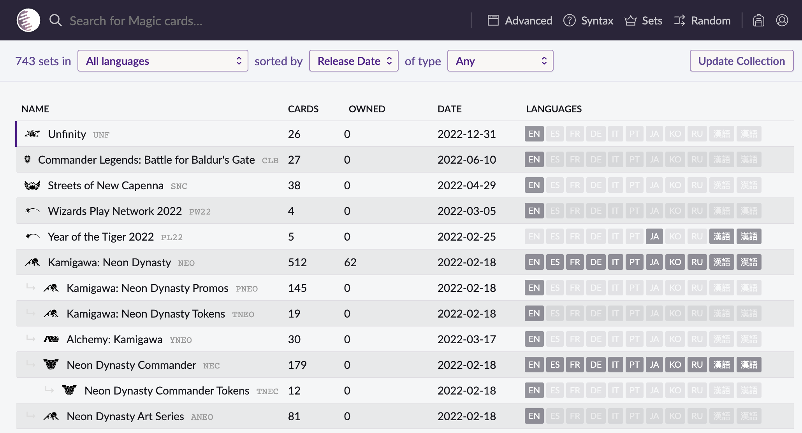
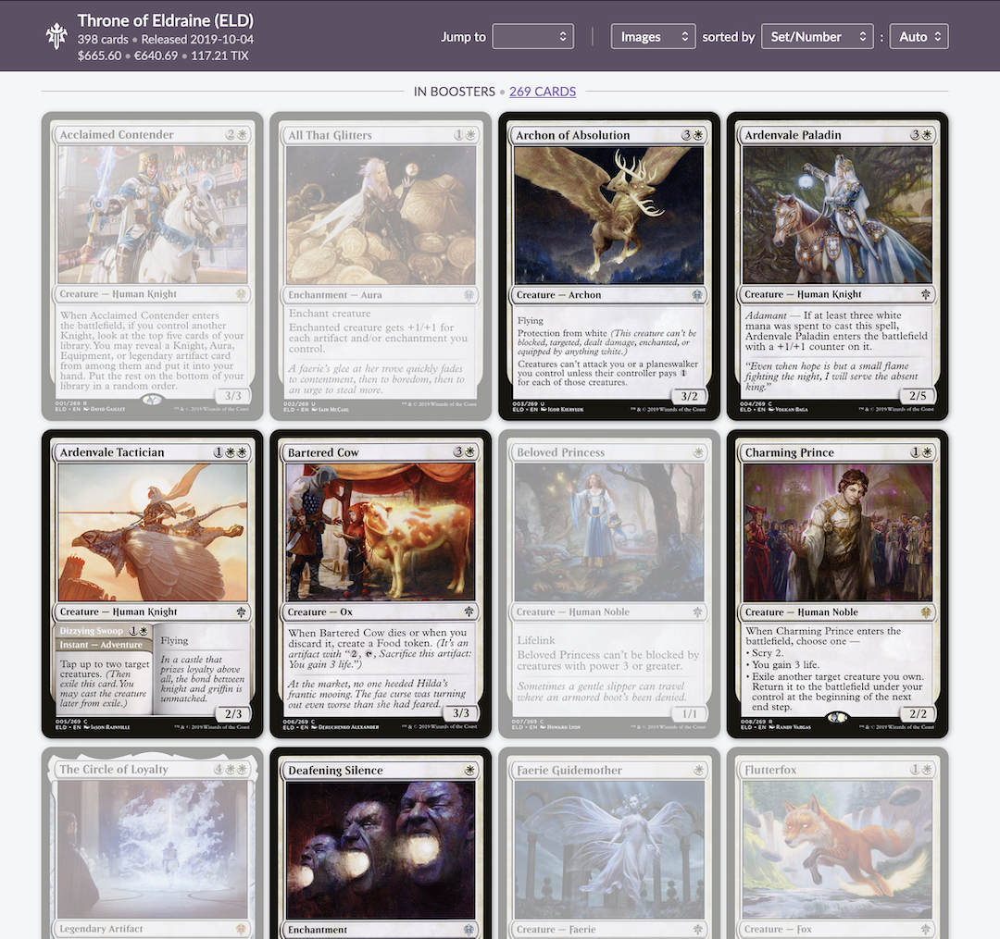

# mtg-collection-visualizer

Visualizes your magic the gathering collection on ScryFall. The visualizer is currently only working for ScryFall with a Moxfield CSV

Project is currently only available as a userscript for [TamperMonkey](https://chrome.google.com/webstore/detail/tampermonkey/dhdgffkkebhmkfjojejmpbldmpobfkfo?hl=en)

TODO:

- [x] Upload CSV button on scryfall sets page.
- [x] have collection CSV persist between sessions.
- [x] Visualize amount of cards owned per set.
- [x] Highlight owned cards in set.
- [x] Persist collection visualisation with scryfall's filters.
- [ ] Visualize percentage owned total and per set.
- [ ] Progress meter.
- [ ] Toggle sets for exclusion / Remove non-paper sets.
- [ ] Visualizer for partial searched cards.
- [ ] Rewrite moxfield's CSV format to standard CSV format.
- [ ] Distinct between Foil and non-foil.
- [ ] CardMarket support.
- [ ] Chrome extension support.
